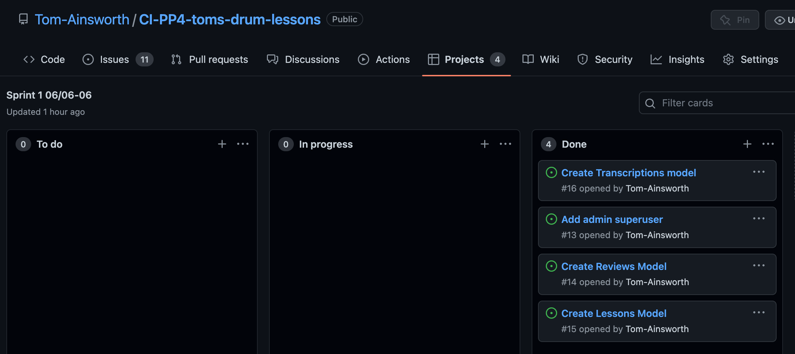
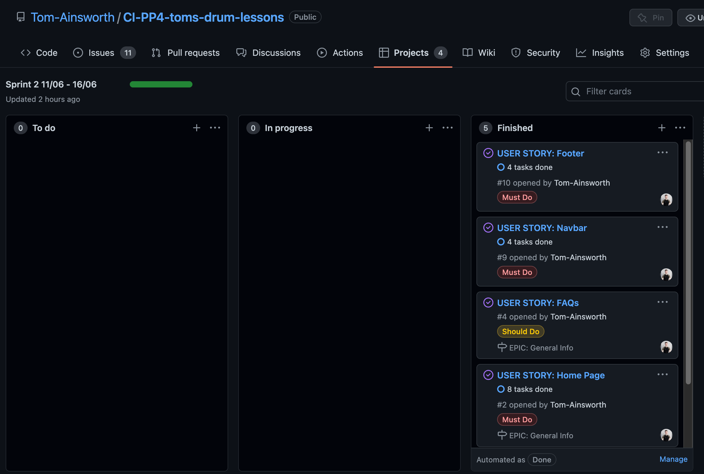
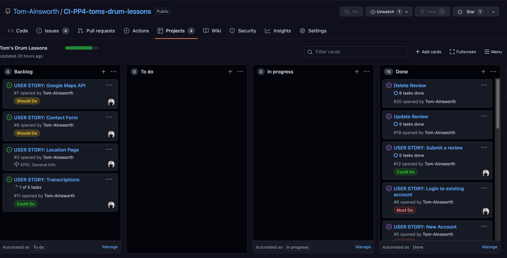
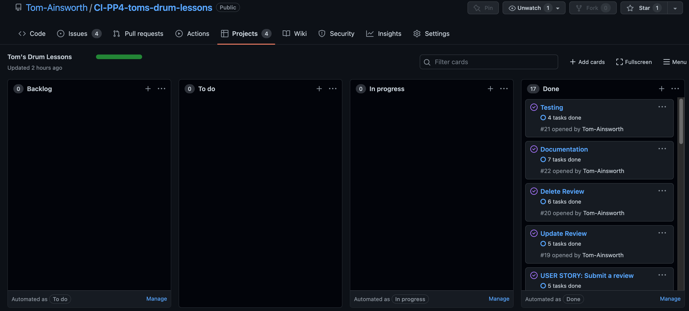

# Agile Methodology

[Back to main Readme document](README.md)

- [Overview](#overview)
  - [Sprint 1 notes:](#sprint-1)
  - [Sprint 2 notes:](#sprint-2)
  - [Sprint 3 notes:](#sprint-3)
  - [Sprint 4 notes:](#sprint-4)

## Overview

As mentioned, Github projects was the the project management tool of choice for this project. The process of how I utilised it throughout changed slightly after the second sprint to break up the user stories into tasks more clearly. Below is a summary of each sprint I did, along with any problems or extra work done.

### Sprint 1

06/06 - 10/06

In order to better gauge my workflow, I started off with a smaller sprint to see how much I could get done. The aim of this sprint was simply to setup the Django project and connect the models to the admin panel, and get the project deployed. As I was still getting used to using a project, some tasks such as Heroku Deployment have been missed, as I did it as soon as I set the project up. On reflection, the stories/tasks here weren't specific enough, and if I were to give someone else these tasks, there would have been several followup questions, such as "What fields go in each model?", "What should the superuser be called?". Without seeing the data schema, these questions would have taken more time than necessary to answer, so I will refine the stories a bit more in future.

### Sprint 2

11/06 - 16/06

All notes made up until this point were written after sprint 2, where I can now look back and plan the next sprint properly. The tasks for each user story were added after the screenshots were taken, so please assume that the user story description was completely blank for sprints 1 and 2.

I went straight into sprint 2 before reflecting properly on sprint 1, and therefore made similar mistakes when carrying out tasks. Some of the stories have a better indication of what they are "navbar" and "footer" for example, but again could be broken down into tasks to make them easier to understand. I also setup a new project for this sprint as I was unsure how to structure the workflow.

At this point I have setup a new project named Tom's Drum Lessons, and will keep all user stories in the backlog of this project, and add any items to the To Do section when they are selected for the current sprint. This will save time going back and forth between projects, and allow me to see an overall shape of how the project is doing.

For the actual work done here, I was quite happy with the progress. I added most of the static pages, and chose to do the FAQ section as that was originally going to be all hardcoded too. As I was writing the code I found myself copying and pasting a lot of bootstrap code to make the accordion section. I then opted to add a new model for all of the Questions, allowing me to build a listview to display the quesitons, while keeping the HTML a lot cleaner.

### Sprint 3

16/06 - 21/06

#### Sprint Planning

The primary objective for this sprint is to get the Calendly booking page done. This is a must have for the site, and as I am feeling more confident with adding the Django views, I am happy to leave those for a later date. I anticipate that the booking page will take a little longer to implement properly. The user stories for this sprint are: Create the bookings page, transcriptions page and findme/location page. If I have time I will make a start on the login system, and how that will look for authorised users.

It turned out that integrating Calendly was a simple copy and paste of the Calendly code snippet, meaning I had a lot more time than expected to work on everything else. After having a meeting with my mentor, Spencer, I decided it would be a better idea to add the authentication in prior to doing the above views, that way I can focus on the reviews page and adding CRUD functionality fully.

#### Sprint Reflection

This sprint was the most research heavy of the project. It was definitely the right decision to change the scope of this sprint. The site now has full CRUD functionality in the reviews section, with users able to create a review once they have logged in. It took a while for me to add the functionality, particularly the update portion, I was struggling to pass the data from the template to the view to edit. I decided to go with Django's built in generic UpdateView, as it is purpose built for this. I wanted to make all CRUD functions use these same generic views to keep the code clean and consistent, however the CreateView still requires a get method I didn't want to break the site with it already working as I'd like. I may go back and edit the view if I have time, but it isn't essential. For the final sprint, I will aim to finish the documentation for the current features as the priority, then add any should have or could have features to improve the site.

### Sprint 4

24/06 - 29/06

#### Sprint Planning

As mentioned above, the main goal is to complete the documentation. This will also include testing, as that is an essential requirement for the project.

#### Sprint Reflection

This one took a little longer than planned to get through the documentation. I'm very glad I was doing most of it as I went along as it made it a lot easier to recall any bugs or plan changes. During testing I spent a lot of time going over minor improvements. The advice on Lighthouse is very helpful for learning more about performance improvements, and I managed to raise scores to almost 100% across the board simply from following the steps. Small things like making sure images are correctly sizes, rather than trying to shrink an image that is 6000px wide mean the site can load quicker, and sublte SEO tips like making sure the description is set correctly, rather than it being boilerplate code are things that I would've missed had I not run the tests. Due to time constraints coming up, I had to cut this sprint a day short, and therefore didn't have time to add some of the 'should have' user stories like a transcriptions or lessons page. These would probably be the next features to add should I continue to work on this project.
