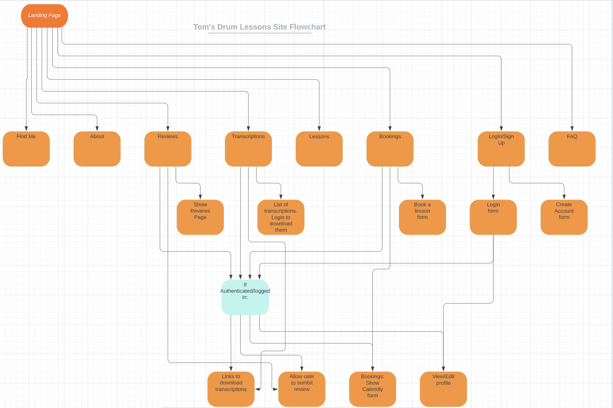

# Toms Drum Lessons

## Code Institute Portfolio Project 4

Although I am in the process of changing careers, I currently teach 1-1 drum lessons in person. One of the primary reasons I became interested in web development was to build my own website to advertise my business, and host lessons online. This website is aimed at people of all ages who are interested in taking drum lessons with me at my studio, and want to find out a bit more about me and what I can offer, before booking a lesson.

[Live Site](https://toms-drum-lessons.herokuapp.com/)

## Contents

- [Toms Drum Lessons](#toms-drum-lessons)
- [UX Design](#ux-design)
  - [Strategy Plane](#strategy-plane)
  - [Scope Plane](#scope-plane)
  - [Structure Plane](#structure-plane)
    - [User Stories](#user-stories)
  - [Skeleton Plane](#skeleton-plane)
  - [Surface Plane](#surface-plane)

## UX Design

### Strategy Plane

- Site Goal

  - As mentioned above, the site goal is to attract potential customers to take drum lessons.

- Target Audience

  - As lessons are in person, the target audience is primarily people living nearby the studio, as they will need to be physically present during the lessons. As of 2021, there are around 329,000 people living in Wandsworth, London (The borough in which the studio is located). Giving a huge amount of potential customers. This is excluding other adjacent boroughs where current students are happy to travel from, so the actual scale of potential customers is far greater.

- Is there a need for this?

  - As one of the only drum teachers in the surrounding area, the demand for drum teachers far outways the demand. There are currently 4 other teachers in the area, 3 of which do not have a website or significant online presence.

- Is the content relevant?

  - Drumming has been proven to have several health benefits, such as improving problem solving skills, relieving stress and tension, boosting creativity, increasing focus and goal setting through practice, along with generally being a very fun and accessible instrument to learn.

- Customer Needs:

  - At the very least, the customer should know who I am, how to contact me, and where the lessons take place.
  - Further needs can be seen below, with the level of importance and feasability scored.

| Opportunity                                            | Importance | Viability/Feasibility |
| ------------------------------------------------------ | ---------- | --------------------- |
| Landing page with site overview                        | 5          | 5                     |
| About Section                                          | 5          | 5                     |
| Location Section                                       | 5          | 5                     |
| Enquiries Section                                      | 5          | 4                     |
| Lesson Info Section                                    | 5          | 5                     |
| Availability Form to book a lesson                     | 4          | 3                     |
| Google maps APIintegration to show studio location     | 3          | 2                     |
| Song Transcriptions Section with downloadable material | 3          | 1                     |
| Tips/resources                                         | 2          | 5                     |
| Current Student reviews                                | 4          | 4                     |
| New User submitted reviews                             | 3          | 3                     |
| User log in                                            | 5          | 5                     |
| Transcription requests                                 | 2          | 3                     |
| Blog style lessons                                     | 2          | 5                     |
| Video Lessons                                          | 2          | 2                     |
| User profile                                           | 5          | 3                     |
| ----------------------------------------               | ----       | ----                  |
| Totals: 16                                             | 60         | 60                    |

As the viability score matches the importance score, I should in theory be able to implement all of the above features. This may well change as I begin the work, due to distractions and unforseen difficulties. The scores above have been based on my own skill levels currently. I may have estimated incorrectly for some, therefore changing the time needed. Between sprints I will reassess each opportunity to see what is more feasable.

### Scope Plane

In order to manage the workload for each sprint, I have divided the above opportunities into three categories, depending on their overall importance to reaching a minimum viable product (MVP).

- Must Have

  - Landing Page
  - About Section
  - Enquiries Section
  - User Log In
  - Location Section
  - Lesson Info Section

- Should Have

  - Availability Form
  - Tips/Resources
  - Current Student Reviews
  - New User Reviews
  - Transcription Section

- Could Have
  - Google Maps API Integration
  - Transcription Requests
  - Blog style lessons
  - Video Lessons
  - User Profile

### Structure Plane

#### User Stories

- New Students

  - As someone interested in learning drums, I want to find a teacher online, so that I can learn more about that person.
  - As a new drummer, I want to see who I am taking lessons with, so that I can feel comfortable meeting a new teacher.
  - As a parent, I want to know whether the teacher teaches children, so that I know I am safe to leave my child during the lessons.
  - As an adult, I want to know if I am too old to start taking lessons, so that I can avoid wasting my time
  - As someone with a tight schedule, I want to book exact time slots, so that I can plan the lessons around my life.
  - I want to contact Tom before booking, to ask him questions about the lessons, so that I can make an informed decision about whether to take lessons.
  - As a visual learner, I want to see and hear what is being played, so that I can play along and watch what is happening.
  - As a visual learner, I want to see music written down, so that I can read and learn it at my own pace.
  - As a kinesthetic learner, I want to get stuck in and play along at the same time as Tom, rather than starting and stopping.
  - As a new user, I want to see reviews from real people, so that I can find out if Tom is a good teacher for me.

- Current Students
  - As a current student, I want to have a profile, so that I can don't have to enter my details everytime I use the site.
  - As a drum student, I want to request new songs to have the sheet music for
  - As a satisfied customer, I want to submit a review on Tom's site to share my experience.
  - As a reading drummer, I want to download transcriptions of new songs to learn between lessons.

### Skeleton Plane

#### Site Flow

Below is a flow chart of how I envisage the flow of the site to look. For an unregistered user, they will have read only access to the site, with prompts to create an account to see extra features.

#### Database Schema

Here is the initial idea for how the backend will look should all of the features be implemented.

#### Wireframes

- [Homepage](readme-content/wireframes/homepage.png)
- [About Page](readme-content/wireframes/about-page.png)
- [Lessons Page](readme-content/wireframes/lessons-page.png)
- [Bookings Page](readme-content/wireframes/bookings-page.png)
- [Find Us Page](readme-content/wireframes/find-us-page.png)
- [Transcriptions Page](readme-content/wireframes/transcriptions-page.png)
- [Reviews Page](readme-content/wireframes/reviews-page.png)
- [FAQ Page](readme-content/wireframes/faq-page.png)
- [Login/Sign Up Page](readme-content/wireframes/login-signup-page.png)

### Surface Plane
