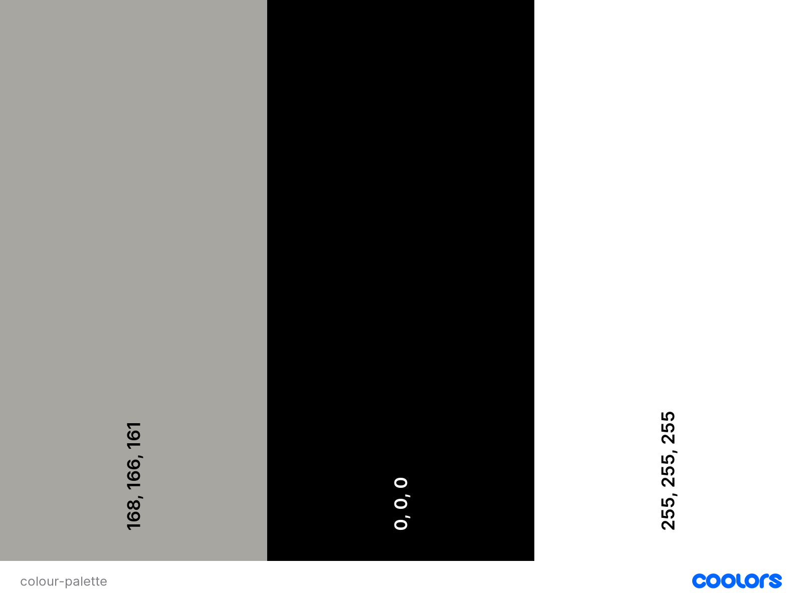

# Toms Drum Lessons

## Code Institute Portfolio Project 4

Although I am in the process of changing careers, I currently teach 1-1 drum lessons in person. One of the primary reasons I became interested in web development was to build my own website to advertise my business, and host lessons online. This website is aimed at people of all ages who are interested in taking drum lessons with me at my studio, and want to find out a bit more about me and what I can offer, before booking a lesson.


## [Live Site](https://toms-drum-lessons.herokuapp.com/)

## Contents

- [Toms Drum Lessons](#toms-drum-lessons)
- [UX Design](#ux-design)
  - [Strategy Plane](#strategy-plane)
  - [Scope Plane](#scope-plane)
  - [Structure Plane](#structure-plane)
    - [User Stories](#user-stories)
  - [Skeleton Plane](#skeleton-plane)
    - [Site Flow](#site-flow)
    - [Database Schema](#database-schema)
    - [Wireframes](#wireframes)
  - [Surface Plane](#surface-plane)
    - [Colour Scheme](#colour-scheme)
    - [Typography](#typography)
- [Agile Development Process](#agile-development-process)
- [Current Features](#current-features)
  - [Navbar](#navbar)
    - [Logged Out](#logged-out)
    - [Logged In](#logged-in)
    - [Mobile Navigation](#mobile-navigation)
  - [Home Page](#home-page)
  - [About Page](#about-page)
  - [Bookings Page](#bookings-page)
  - [Reviews Page Logged Out](#reviews-page-logged-out)
  - [Reviews Page Logged In](#reviews-page-logged-in)
  - [Create a Review](#create-a-review)
  - [Update a Review](#update-a-review)
  - [Delete a Review](#delete-a-review)
  - [FAQs Page](#faqs-page)
  - [Footer](#footer)
- [Future Development](#future-development)
- [Testing](#testing)
- [Deployment](#deployment)
- [Technologies Used](#technologies-used)
- [Honourable Mentions](#honourable-mentions)
- [Credits](#credits)

## UX Design

### Strategy Plane

- Site Goal

  - As mentioned above, the site goal is to attract potential customers to take drum lessons.

- Target Audience

  - As lessons are in person, the target audience is primarily people living nearby the studio, as they will need to be physically present during the lessons. As of 2021, there are around 329,000 people living in Wandsworth, London (The borough in which the studio is located). Giving a huge amount of potential customers. This is excluding other adjacent boroughs where current students are happy to travel from, so the actual scale of potential customers is far greater.

- Is there a need for this?

  - As one of the only drum teachers in the surrounding area, the demand for drum teachers far outways the demand. There are currently 4 other teachers in the area, 3 of which do not have a website or significant online presence.

- Is the content relevant?

  - Drumming has been proven to have several health benefits, such as improving problem solving skills, relieving stress and tension, boosting creativity, increasing focus and goal setting through practice, along with generally being a very fun and accessible instrument to learn.

- Customer Needs:

  - At the very least, the customer should know who I am, how to contact me, and where the lessons take place.
  - Further needs can be seen below, with the level of importance and feasability scored.

| Opportunity                                            | Importance | Viability/Feasibility |
| ------------------------------------------------------ | ---------- | --------------------- |
| Landing page with site overview                        | 5          | 5                     |
| About Section                                          | 5          | 5                     |
| Location Section                                       | 5          | 5                     |
| Enquiries Section                                      | 5          | 4                     |
| Lesson Info Section                                    | 5          | 5                     |
| Availability Form to book a lesson                     | 4          | 3                     |
| Google maps APIintegration to show studio location     | 3          | 2                     |
| Song Transcriptions Section with downloadable material | 3          | 1                     |
| Tips/resources                                         | 2          | 5                     |
| Current Student reviews                                | 4          | 4                     |
| New User submitted reviews                             | 3          | 3                     |
| User log in                                            | 5          | 5                     |
| Transcription requests                                 | 2          | 3                     |
| Blog style lessons                                     | 2          | 5                     |
| Video Lessons                                          | 2          | 2                     |
| User profile                                           | 5          | 3                     |
| ----------------------------------------               | ----       | ----                  |
| Totals: 16                                             | 60         | 60                    |

As the viability score matches the importance score, I should in theory be able to implement all of the above features. This may well change as I begin the work, due to distractions and unforseen difficulties. The scores above have been based on my own skill levels currently. I may have estimated incorrectly for some, therefore changing the time needed. Between sprints I will reassess each opportunity to see what is more feasable.

### Scope Plane

In order to manage the workload for each sprint, I have divided the above opportunities into three categories, depending on their overall importance to reaching a minimum viable product (MVP).

- Must Have

  - Landing Page
  - About Section
  - Enquiries Section
  - User Log In
  - Location Section
  - Lesson Info Section

- Should Have

  - Availability Form
  - Tips/Resources
  - Current Student Reviews
  - New User Reviews
  - Transcription Section

- Could Have
  - Google Maps API Integration
  - Transcription Requests
  - Blog style lessons
  - Video Lessons
  - User Profile

### Structure Plane

#### User Stories

- New Students

  - As someone interested in learning drums, I want to find a teacher online, so that I can learn more about that person.
  - As a new drummer, I want to see who I am taking lessons with, so that I can feel comfortable meeting a new teacher.
  - As a parent, I want to know whether the teacher teaches children, so that I know I am safe to leave my child during the lessons.
  - As an adult, I want to know if I am too old to start taking lessons, so that I can avoid wasting my time
  - As someone with a tight schedule, I want to book exact time slots, so that I can plan the lessons around my life.
  - I want to contact Tom before booking, to ask him questions about the lessons, so that I can make an informed decision about whether to take lessons.
  - As a visual learner, I want to see and hear what is being played, so that I can play along and watch what is happening.
  - As a visual learner, I want to see music written down, so that I can read and learn it at my own pace.
  - As a kinesthetic learner, I want to get stuck in and play along at the same time as Tom, rather than starting and stopping.
  - As a new user, I want to see reviews from real people, so that I can find out if Tom is a good teacher for me.

- Current Students
  - As a current student, I want to have a profile, so that I can don't have to enter my details everytime I use the site.
  - As a drum student, I want to request new songs to have the sheet music to play along with.
  - As a satisfied customer, I want to submit a review on Tom's site to share my experience.
  - As a reading drummer, I want to download transcriptions of new songs to learn between lessons.

These were the initial user stories I had, however once I began entering them on github as issues, I realised that they were much more tailored the actual business I do, rather than what the website can offer users. As such please see the [project board](https://github.com/Tom-Ainsworth/CI-PP4-toms-drum-lessons/projects/1) to see actual user stories and tasks carried out that can be directly related to the site features.

Here is a list of user stories dropped as part of the agile process

- As a visual learner, I want to see and hear what is being played, so that I can play along and watch what is happening.
- As a visual learner, I want to see music written down, so that I can read and learn it at my own pace.
- As a reading drummer, I want to download transcriptions of new songs to learn between lessons.

### Skeleton Plane

#### Site Flow

Below is a flow chart using [Lucid Charts](https://www.lucidchart.com/) of how I envisage the flow of the site to look. For an unregistered user, they will have read only access to the site, with prompts to create an account to see extra features.


#### Database Schema

Here is the initial idea for how the backend will look should all of the features be implemented. I used [Lucid Charts](https://www.lucidchart.com/) once again to create the mockup.


The Transcriptions and Lessons entities will only be writtable from an admin, so that I can maintain the quality of the material. Reviews will require a login to post, and will be subject to admin approval. They will be connected to the user so that each user can be identified in their review.

#### Wireframes

- [Homepage](readme-content/wireframes/homepage.png)
- [About Page](readme-content/wireframes/about-page.png)
- [Lessons Page](readme-content/wireframes/lessons-page.png)
- [Bookings Page](readme-content/wireframes/bookings-page.png)
- [Find Us Page](readme-content/wireframes/find-us-page.png)
- [Transcriptions Page](readme-content/wireframes/transcriptions-page.png)
- [Reviews Page](readme-content/wireframes/reviews-page.png)
- [FAQ Page](readme-content/wireframes/faq-page.png)
- [Login/Sign Up Page](readme-content/wireframes/login-signup-page.png)

After doing the mockups for each page I realised there is a lot to do in a short space, so I will be really narrowing things down to begin with. The homepage is vital, as are the login/sign up, about, bookings and find us pages. I will start with these first to ensure the core functionality of the site is working, and then go through the others as time permits.

### Surface Plane

#### Colour Scheme

The site features a minimalistic colour scheme, allowing text ot contrast well against both the background, and images.



#### Typography

The main font of the entire site is Nanum Gothic from [Google Fonts](https://fonts.google.com/specimen/Nanum+Gothic?query=gothic). I used sans-serif as a backup as they use the same typeface.

## Agile Development Process

I used Github's issues and projects to keep track of the progress throughout the project. The main project board can be found [here](https://github.com/Tom-Ainsworth/CI-PP4-toms-drum-lessons/projects/5)
Notes on individual sprints, including tasks completed and problems encountered can be found in a the [AGILE.md](AGILE.md) file.

## **Current Features**

### **Navbar**

#### Logged Out


When the user is logged out, both the Login and Sign Up buttons appear, linked to the relevant pages

#### Logged In


When the user is logged in, a Logout button appears, allowing them to log out

#### Mobile Navigation


The authentication functionality is the same as above, however on smaller screens a burger menu appears, which drops down to reveal the navbar links.

### **Home Page**


The home/landing page of the site features a Title with subheading outlining exactly what the site is. There is also an embedded video of myself playing drums, so users can see my abilities. The background image is the studio where the lessons take place, which can also be seen throughout the site, and in the video.

### **About Page**


The about sections features some more images of myself, from both my drum kit and where the students sit to give users an idea of what to expect. The text here is about my journey on the drums and what I currently do. On smaller screens the page shrinks to a single column to maintain the text and image size.

### **Bookings Page**


The bookings page is very simple so not to distract from it's purpose. There is some text explaining how to book a lesson, followed by a button connected to my Calendly calendar for users to book a lesson. Should users want to know more, I added a link to the FAQs section (see below).

### **Reviews Page Logged Out**


When logged out, users can view all reviews on the page, but are unable to do any further actions. The reviews are paginated to display 3 reviews per page, with forward and backward buttons when necessary. On smaller screens, reviews are displayed in a single column to maintain the text size.

### **Reviews Page Logged In**


When authenticated, users are able to create a new review via the 'write a review' button. Should the already have a review, they can update and delete that review via the buttons that appear on the corresponding cards.

### **Reviews Page No Access**


If a logged in user manually enters a url to create, update or delete another user's review, they are met with an error message asking them to log in to the correct account.

### Create a review


A blank form page shows for users to create a new review. Both fields are required and will notify the user should either be blank. All reviews are pending admin approval.

### Update a review


The update view will prefill the necessary fields with existing data, and the user can edit either or both fields as they wish.

### Delete a review


This view loads an extra page for users to confirm that they want to delete their review, and an option to go back to the reviews page should they change their mind.

### FAQs Page


The Frequently asked questions section features an accordion layout. This is read only for all users, and each question is dynamically added to the page from the Questions model, so that I can add or remove questions without touching the code.

### Footer


The footer features a more subtle grey text colour than the rest of the site to differentiate it. I split it into 3 columns: Opening hours, contact links, Studio Address.

## **Future Development**

- User profiles section to add personal info, see reviews, book lessons
- Online community to discuss lessons and share progress
- SaaS business model with different access tiers for different content through monthly recurring subscriptions
- Internal booking system rather than Calendly link
- Payment system so users can fully book a lesson
- Review replies so users can see that I've responded to them

## Testing

A full breakdown of testing can be seen in the [TESTING.md](TESTING.md) document.

## Deployment

The live site was deployed to [Heroku](https://dashboard.heroku.com) using the following steps:

Below are the steps I took to deploy the site to Heroku and any console commands required to initiate it.

### Create repository:

1. Create a new repository in GitHub, ticking the boxes for readme, and gitignore files, and clone it locally following [these instructions](https://docs.github.com/en/repositories/creating-and-managing-repositories/cloning-a-repository)
   - **_Note_** - If you are cloning my project, then you can skip all pip3 installs below and just run the following command in the terminal to install all the required libraries/packages at once:
     - `pip3 install -r requirements.txt`
   - **_IMPORTANT_** - If developing locally on your device, ensure you set up/activate the virtual environment (See below) before installing/generating the requirements.txt file. If you install the requirements before creating a virtual environment, all of the dependencies will be installed on your machine, create unecessary clutter and potentially affecting future projects using the same dependencies.

### Setting up the Workspace (To be done locally via the console of your chosen editor):

1. Open your project and `cd` into the workspace directory. You can type `ls` into the terminal to see what files are in your current working directory.
1. Create a virtual environment on your machine (Can be skipped if using gitpod):
   - python3 -m venv .venv
1. To ensure the virtual environment is not tracked by version control, add .venv to the .gitignore file.
1. Install the latest version of Django with
   - `pip3 install django`
1. Install gunicorn:
   - `pip3 install gunicorn`
1. Install supporting libraries:
   - `pip3 install dj_database_url psycopg2`
   - `pip3 install dj3-cloudinary-storage`
1. Create requirements.txt:
   - `pip3 freeze --local > requirements.txt`
1. Create a project in the current directory:
   - `django-admin startproject <PROJECT_NAME>` (in the case of this project, the project name was "tomsdrumlessons")
1. Create an app within the project:
   - `python manage.py startapp APP_NAME` (in the case of this project, I used several apps for different pages, such as 'home', 'bookings', 'reviews', so that I knew where the code for each page was located)
1. Add the new app(s) to the list of installed apps in setting.py, make sure to put them in quotation marks like all of the other installed apps, and seperate each one with a comma `,`
1. Migrate changes:
   - `python manage.py migrate`
1. Test server works locally:
   - `python manage.py runserver` (You should see the default Django success page)

### Create Heroku App:

The below works on the assumption that you already have an account with [Heroku](https://id.heroku.com/login) and are already signed in.

1. Create a new Heroku app:
   - Click "New" in the top right-hand corner of the landing page, then click "Create new app."
1. Give the app a unique name:
   - Will form part of the URL (in the case of this project, I called the Heroku app toms-drum-lessons)
1. Select the nearest location:
   - For me, this was Europe.
1. Add Database to the Heroku app:
   - Navigate to the Resources tab of the app dashboard. Under the heading "Add ons," search for "Heroku Postgres" and click on it when it appears.
   - Select "Hobby Dev - Free" from the "plan name" drop-down menu and click "Submit Order Form."
1. From your editor, go to your projects settings.py file and copy the SECRET_KEY variable. Add this to the same name variable under the Heroku App's config vars.
   - left box under config vars (variable KEY) = SECRET_KEY
   - right box under config vars (variable VALUE) = Value copied from settings.py in project.

### Creating Environmental Variables Locally:

1. In the top level of your directory, type `touch env.py` and add this to the .gitignore file.
1. From the Heroku app settings tab, click "reveal config vars" and copy the value of the variable DATABASE_URL. Add this value to a variable called DATABASE_URL in your create .env file:
   - `"DATABASE_URL"="databaseurl"`
1. From your projects settings.py file, copy the SECRET_KEY value and assign it to a variable called SECRET_KEY in your .env file
   - `"SECRET_KEY"="thisismysecretkey"` If you'd rather change this, you can generate a new one with [Djecrety](https://djecrety.ir/)
1. Add CLOUDINARY_URL variable to .env file:
   - Log into [cloudinary](https://cloudinary.com) and from the dashboard copy the API Environmental Variable. (Create a new account if you don't have one, this is where the static files will be stored.)
   - Add to `env.py` file like so:
     - `CLOUDINARY_URL"="PastedApiEnvironmentalVariable"` **Make sure to remove the `CLOUDINARY_URL=` from the pasted variable**

### Setting up setting.py File:

1. At the top of your settings.py file, add the following snippet immediately after the other imports:
   ```
       import os
       import dj_database_url
       if os.path.isfile('env.py'):
           import env.py
       SECRET_KEY = os.environ.get("SECRET_KEY")
       DEBUG = True
   ```
1. Delete the value from the setting.py DATABASES section and replace it with the following snippet to link up the Heroku Postgres server:

   ```
   DATABASES = {
   'default': dj_database_url.parse(os.environ.get("DATABASE_URL"))
   }
   ```

1. Add Cloudinary libraries to the installed apps section of settings.py file:

   ```
    INSTALLED_APPS = [
   …,
   'cloudinary_storage',
   'django.contrib.staticfiles',
   'cloudinary',
   …,
   ]
   (note: order is important)
   ```

1. Tell Django to use Cloudinary to store media and static files by placing this snippet under the comments indicated below:

```
    # Static files (CSS, JavaScript, Images)
    # https://docs.djangoproject.com/en/3.2/howto/static-files/
    STATIC_URL = '/static/'
    STATICFILES_STORAGE = 'cloudinary_storage.storage.StaticHashedCloudinaryStorage'
    STATICFILES_DIRS = [os.path.join(BASE_DIR, 'static/')]
    STATIC_ROOT = os.path.join(BASE_DIR, 'staticfiles')
    MEDIA_URL = '/media/'
    DEFAULT_FILE_STORAGE = 'cloudinary_storage.storage.MediaCloudinaryStorage'
```

1. Under the line with BASE_DIR, link templates directly in Heroku via settings.py:

   - `TEMPLATES_DIR = os.path.join(BASE_DIR, 'templates')`

1. Within the TEMPLATES array, add `'DIRS':[TEMPLATES_DIR]` like the below example:

```
   TEMPLATES = [
       {
           …,
           'DIRS': [TEMPLATES_DIR],
           …,

        },
       },
   ]
```

1. Add allowed hosts to settings.py:

   - `ALLOWED_HOSTS = ["PROJECT_NAME.herokuapp.com", "127.0.0.1"]` (127.0.0.1 works for me, however if that fails try `localhost` instead.)

1. Create a Procfile at the top level of the file structure and insert the following:

   - `touch Procfile` (the capital P is important!)
   - Inside that file, add `web: gunicorn PROJECT_NAME.wsgi`

1. Make an initial commit and push the code to the GitHub Repository.
   - `git add .`
   - `git commit -m "Initial deployment"`
   - `git push`

### Deploy the project

1. For the live project, ensure that `DEBUG = False` in settings.py
1. Go to your Heroku project dashboard, and click on the 'Deploy' tab
1. Next to 'Deployment method', choose the right one for you. I deplyed via Github so the instructions below are related to that.
1. Click on the Github icon 'connect to GitHub'
1. Login to your GitHub account if needed, then search for the repository you want to connect the site to.
1. When it shows up below, click 'connect'.
1. Next to 'Automatic deploys' choose the branch you'd like to deploy from. In most cases this will be 'main'.
1. Click 'Enable Automatic Deploys' if you would like Heroku to deploy your code everytime you push it to the above branch.
1. If you prefer to deploy manually, scroll down to 'Manual deploy', choose your branch, and click 'Deploy Branch'
1. Scroll back to the top, and once it's finished deploying, click 'Open app', on the top right side.

Congratualations, you've deployed your site!

## **Technologies used**

- Python
  - All packages used can be found in the [requirements.txt](requirements.txt) file
- [Django](https://www.djangoproject.com/) - The Model View Template framework used to build the project and apps.
  - [allauth](https://django-allauth.readthedocs.io/en/latest/installation.html) was used for the login/out functionality and templates.
- [Heroku](https://dashboard.heroku.com)
  - for deployment and hosting
- [Heroku Postgres](https://elements.heroku.com/addons/heroku-postgresql)
  - used for the database
- HTML
  - Used for the template structures
- CSS
  - Used to style the markup
- Javascript
  - Custom use minimal, to set a timeout on bootstrap messages.

## Honourable Mentions

- Spencer Barriball - My mentor throughout the project. Always able to answer any questions I have and is such a positive person to have around.
- Ellie Pitkin - My partner who is always so understanding when I'm stuck in a rut or need to spend extra time to push through a problem. I couldn't ask for a more supportive person to have around me during this.
- David Bowers for the amazing readme structure, seeing your finished write up made it incredibly easy for me to plan and excute this project, thanks a lot! That and the advice about implementing widget tweaks in forms was incredibly helpful.
- Simen Daehlin for the amazing [VS Code tutorial](https://blog.dehlin.dev/vscode-checklist)
- The Code Institute Slack community for having an answer to seemingly everything. The perks of going through course after it's been through a few iterations.
- [Min Giorgis](https://instagram.com/giorgis_media?igshid=YmMyMTA2M2Y=) for taking some amazing photos for me!

## Credits

- [Balsamiq](https://balsamiq.com/) for creating the wireframes
- VS Code for the text editor
- [Bootstrap](https://getbootstrap.com/docs/4.6/getting-started/introduction/)
  - Version 4.6.1, CSS framework for building a responsive front end, quickly. Comes with built-in javascript for features like the collapsable navbar, and accordion FAQs section.
- [Cloudinary](https://cloudinary.com/)
  - Used to store static files and media.
- [GitHub](https://github.com/)
  - Used for version control throughout the build process
  - GitHub Projects used to organise user stories and tasks.
- [VS Code Insiders](https://code.visualstudio.com/insiders/)
  - Text editor used to write the code and store the project locally.
- [Lucid Charts](https://lucid.app/)
  - Used for the site flow and ERD diagrams.
- [Coolers](https://coolors.co)
  - for the site colour scheme.
- [Google Fonts](https://fonts.google.com/)
- Calendly
  - for the booking page embedded calendar, it made life very easy for this feature!
- Vimeo
  - Home video hosting and embedding.
- Code Institute I think therefore I blog walkthrough for the review cards for loop, messages and crispy forms implementation
- Cripsy Forms for the create_review template.
- TinyPNG for image file compression
- The PageTitleViewMixin was taken from [Forge Packages](https://www.forgepackages.com/guides/page-titles/)
- General References
  - Stack Overflow
  - GeeksForGeeks
  - Django docs
  - Bootstrap Docs
  - Code Institute LSE
  - W3Schools
