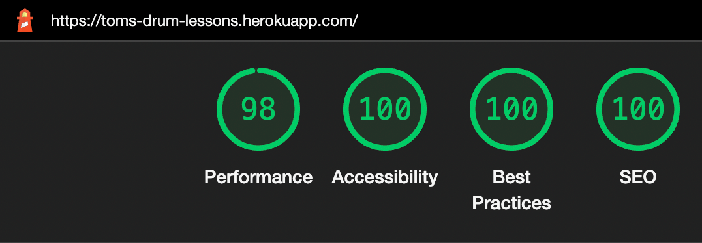
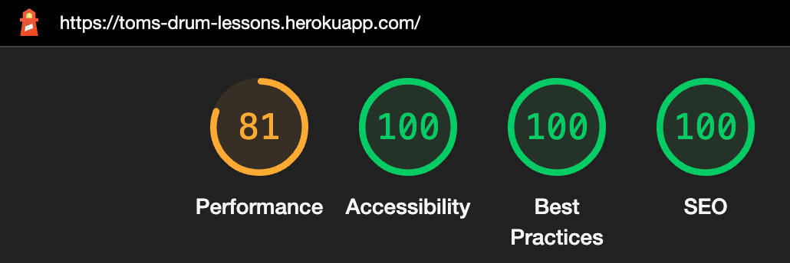
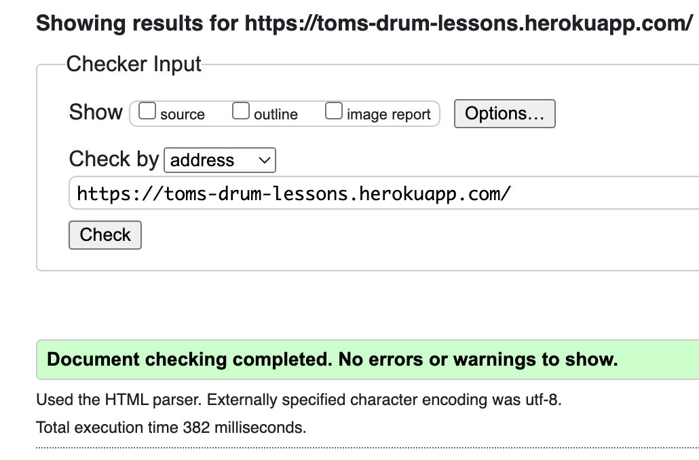
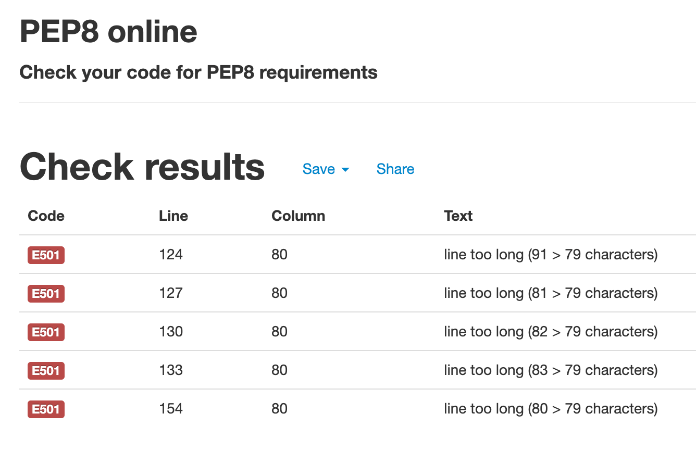

# Testing

[Return to README.md](README.md)

- [Bugs and Fixes During the Development Process](#bugs-and-fixes-during-the-development-process)
- [Wave Aim Accessibility checker:](#wave-aim-accessibility-checker)
- [Lighthouse](#lighthouse)
  - [Mobile](#mobile)
  - [Desktop](#desktop)
- [Validators](#validators)
  - [HTML](#html)
  - [CSS](#css)
  - [Javascript](#javascript)
  - [Python](#python)
- [User Stories](#user-stories)
  - [As an **Admin** I can...](#as-an-admin-i-can)
  - [As an **Unregistered User** I can...](#as-an-unregistered-user-i-can)
  - [As a **Registered User** I can...](#as-a-registered-user-i-can)

## Bugs and Fixes During the Development Process

- Issue - Bookings app would not load at all.
- Cause - Django could not find the 'cloundinary bookings' app
- Solution - [Fix Commit](https://github.com/Tom-Ainsworth/CI-PP4-toms-drum-lessons/commit/5335cba884d78564406acd379ba420e64b5548be) Seperate the apps with a comma.
  css
- Issue - The deployed site on Heroku would not build properly as it couldn't install all dependencies
- Cause - backports.zoneinfo had been set in the requirements.txt file which Heroku couldn't build wheels for, and was therefore not completeling the build.
- Solution - [Fix Commit](https://github.com/Tom-Ainsworth/CI-PP4-toms-drum-lessons/commit/c0f9003a72c683865e5b214b964072c33f5f6f1a) Remove backports.zoneinfo library from requirements.txt as it wasn't necessary. Details on what this library does can be found [HERE](https://pypi.org/project/backports.zoneinfo/)

- Issue - Development server would not load the local host
- Cause - 'localhost' was set as an allowed host rather than 127.0.0.1.
- Solution - [Fix Commit](https://github.com/Tom-Ainsworth/CI-PP4-toms-drum-lessons/commit/c8b15cfddd30dbd47d483891d8db87a3cd76181b) Change the allowed host so that the dev environment can load properly.

- Issue - All Questions in FAQs were showing/hiding whenever a single question was clicked on
- Cause - Becuase questions were being populated by a for loop, the same classes were being added to every question, making them behave in the same way.
- Solution - [Fix Commit](https://github.com/Tom-Ainsworth/CI-PP4-toms-drum-lessons/commit/f28a6bbd7b59645e7c67e237bfdce814e07dcdc8) Added dynamic IDs to the cards and data target attributes to control the collapse class per question.

- Issue - FAQs page title was not displaying, which meant that the container class in base.html was also not loading the black background.
- Cause - QuestionList class was loading the listview before the pagetitle mixin
- Solution - [Fix Commit](https://github.com/Tom-Ainsworth/CI-PP4-toms-drum-lessons/commit/c42ab8f86b1a6accca7b95ec0aaf020e4f0526ab) Swap them around.

- Issue - bookings url was displaying as bookings/bookings
- Cause - url path in bookings.url had 'bookings/' as the path, while tomsdrumlessons urls.py did too.
- Solution - [Fix Commit](https://github.com/Tom-Ainsworth/CI-PP4-toms-drum-lessons/commit/ed05bcc947961ab23a3124561fb295c12e2a602d?diff=split)

- Issue - Navbar not changing active link colour
- Cause - Styling the active state of an anchor tag, rather than the active class in css
- Solution - [Fix Commit](https://github.com/Tom-Ainsworth/CI-PP4-toms-drum-lessons/commit/ed05bcc947961ab23a3124561fb295c12e2a602d) Styling .active rather than .nav-link:active

- Issue - Navbar burger icon not displaying on small screens
- Cause - Styling issue. I hadn't specified a colour for the icon. It functioned as expected, but wasn't visible to the user.
- Solution - [Fix Commit](https://github.com/Tom-Ainsworth/CI-PP4-toms-drum-lessons/commit/1f2b2e650aa3878ebb8465e8699ca4fc43883813) Added the navbar-dark class to the nav element.

- Issue - Reviews displaying with html tags around them
- Cause - Content was being loaded as html rather than plain text.
- Solution - [Fix Commit](https://github.com/Tom-Ainsworth/CI-PP4-toms-drum-lessons/commit/0fae7ed6a55966a7c1c65574dfff8b4261ba6c0a) Added the 'safe' filer to the review body.

- Issue - Heroku build failure
- Cause - Heroku could not find django-summernote==0.8.20.0π
- Solution - [Fix Commit](https://github.com/Tom-Ainsworth/CI-PP4-toms-drum-lessons/commit/92f8cba4712ac7fd0e260b6a4497870dce527830) Typo in requirements.txt on the end of the line. Proof that the smallest thing can have a big effect!

- Issue - Any authenticated user can update or delete any review.
- Cause - There were no checks in place to see whether the logged in user had access to individual entities. This allowed anyone with the specific update or delete url to manipulate the whole database.
- Solution - [Fix Commit](https://github.com/Tom-Ainsworth/CI-PP4-toms-drum-lessons/commit/6dbb1a38e486d175ab6bc8fd66024382ccb5ce0c) Added an if statement to check whether the current user was the same as the user for a given review object. I made the same change for the update view as well in the next commit.

## Wave Aim Accessibility Checker

## Lighthouse

### Desktop

I spent some time altering how the home page video renders, as this was causing a lot of extra load time. The background images on the home page was also taking a while due to its size. I added some media queries to help with this by loading a size similar to the viewport, which drastically reduces the file size

### Mobile

The scores mainly fluctuated between 80-95, mainly around 87/88, however the recurring issue was the unused CSS and JS caused by using the Bootstrap CDN, meaining the initial render was slower than it could have been. I'll consider looking at other alternatives like Tailwind for future projects should I use another framework, as it optimizes the file size based on used CSS.

## Validators

### HTML

No errors were found

### CSS

There were numerous errors caused by Bootstraps classes, but when pasting in my custom css, no errors or warnings were found were found.

### JavaScript

There is only 1 function in the script.js file, for closing messages after 3 seconds. I removed the alert variable as it wasn't necessary, and came up with a warning as the variable'bootstrap' wasn't defined. I retested the messages with this line removed and it still worked as expected.

### Python

[Pep8online.com](http://pep8online.com) was used to test all python files. All efforts were made to make all code pep8 compliant, with the exception of the settings.py file, which Django state in their docs is okay to ignore should it make the code ugglier or harder to read, which in these cases it does.

## User Stories

### As a **New Student** I can...

| Checked | ...**find a teacher online** so that **I can learn more about that person.**                                                                        |
| :-----: | :-------------------------------------------------------------------------------------------------------------------------------------------------- |
| &check; | With an SEO score of 100, I have made it as likely as possible to be found on search engine, and the home page is clear about what the site offers. |

| Checked | ...**see who I am taking lessons with** so that **I can feel comfortable meeting a new teacher.** |
| :-----: | :------------------------------------------------------------------------------------------------ |
| &check; | Video of myself playing drums on the home page, and a detailed 'about me' section                 |

| Checked | ... **see whether the teacher teaches children** so that **I know I am safe to leave my child during the lessons.** |
| :-----: | :------------------------------------------------------------------------------------------------------------------ |
| &check; | In the FAQs section this question has been covered direclty.                                                        |

| Checked | ...**find out if I am too old to start taking lessons** so that **I can avoid wasting my time** |
| :-----: | :---------------------------------------------------------------------------------------------- |
| &check; | Also covered in FAQs                                                                            |

| Checked | ...**book exact time slots** so that **I can plan the lessons around my life.** |
| :-----: | :------------------------------------------------------------------------------ |
| &check; | Bookings page with Calendly built in to book 60 minute slots.                   |

| Checked | ...**Get in touch before booking a lesson** so that **I can ask him any questions that aren't on the site** |
| :-----: | :---------------------------------------------------------------------------------------------------------- |
| &check; | Email address listed in the footer, and FAQs section                                                        |

| Checked | ...**get stuck in and play along at the same time as Tom** to that **I don't have to stop playing for him to demonstrate something.** |
| :-----: | :------------------------------------------------------------------------------------------------------------------------------------ |
| &check; | Answered in FAQs, and imagery throughout the site.                                                                                    |

| Checked | ...**see reviews from real people** to that **I can find out if Tom is a good teacher for me.** |
| :-----: | :---------------------------------------------------------------------------------------------- |
| &check; | Reviews page                                                                                    |

## As a **Current Student** I can...

| Checked | ...**Login to my account** so that **I don't have to enter my details everytime I use the site**      |
| :-----: | :---------------------------------------------------------------------------------------------------- |
| &check; | If the user has cookies enabled, they can stay logged in to their profile when returning to the site. |

| Checked | ...**submit a review on Tom's site** so that **I can share my experience** |
| :-----: | :------------------------------------------------------------------------- |
| &check; | Reviews page                                                               |

| Checked | ...**browse the available jobs (brief description only)** so that **I can see if I wish to register with the site or not** |
| :-----: | :------------------------------------------------------------------------------------------------------------------------- |
| &check; | Can see the preview cards for available jobs                                                                               |
| &check; | Can see I need to sign up/log in to see more info                                                                          |

[Return to README.md](README.md)
